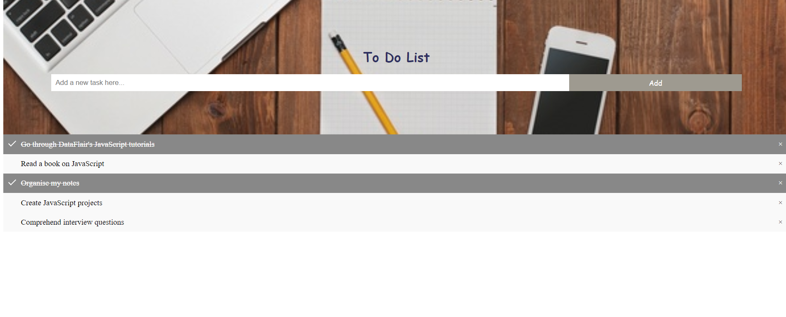

# TO-DO-LIST
This is the to do list created using HTML,CSS and JS.
You can add tasks using the text box provided and click add button.
If you want to remove any task simple click the cross at the right end of the task and if you want to check the task done but don't want to remove it from the list click anywhere on that task.

